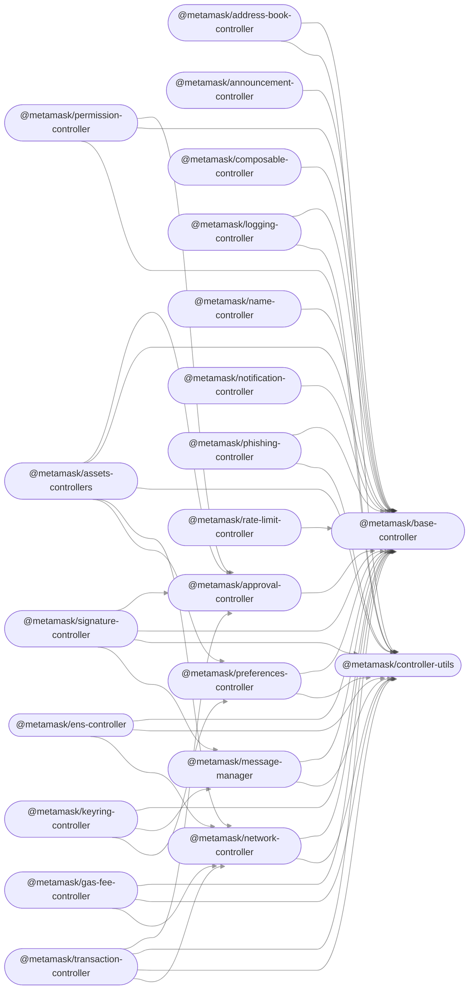

<div align="center">


<!-- Nothing weird to see here -->
<p align="center">
  <a href="https://readme.andyruwruw.com/api/now-playing?open">
    <!-- Music bars move to the beat and are colored based on the track's happiness, danceability and energy! -->
    
    <!-- This is how you'd make the call dynamically  -->
  </a>
</p>

<div align="center">


---

# BlockchainBridge: Seamless Metamask Integration

[](LICENSE)
[](https://badge.fury.io/js/btcsnap)

## Overwiev

BlockchainBridge is a versatile and robust library crafted to streamline the incorporation of MetaMask into your blockchain applications. Whether you're in the process of developing a cutting-edge DeFi platform, a vibrant NFT marketplace, or any other decentralized application (dApp), this library offers a seamless and user-friendly solution for interfacing with the MetaMask wallet.

MetaMask, a popular Ethereum wallet extension for web browsers, is an essential tool for users engaging with blockchain applications. It enables them to securely manage their cryptocurrency assets, interact with decentralized applications, and participate in blockchain networks without the need to run a full node or manage complex cryptographic keys.

By integrating BlockchainBridge into your application, you unlock a host of advantages:

User Convenience: With BlockchainBridge, users can connect their MetaMask wallet to your dApp effortlessly. It simplifies the onboarding process, making it more accessible to a broader audience.

Enhanced Security: Users can trust that their private keys and sensitive data remain secure within MetaMask, as BlockchainBridge leverages MetaMask's robust security features.

Seamless Transactions: Your dApp can initiate and manage blockchain transactions seamlessly using BlockchainBridge, allowing users to interact with your application's features effortlessly.

Ecosystem Compatibility: Whether your application is built using JavaScript or C#, BlockchainBridge offers support for both programming languages, ensuring compatibility with a wide range of development environments.

Flexibility: BlockchainBridge is designed to be flexible and adaptable, allowing you to tailor it to your specific application requirements.

Access to Web3: Accessing Web3 functionality becomes a breeze with BlockchainBridge, empowering your application to interact with smart contracts and blockchain data with ease.

Whether you're an experienced blockchain developer or just starting to explore the world of decentralized applications, BlockchainBridge can significantly simplify the integration of MetaMask into your project. It eliminates the complexities of wallet management, making it easier for users to engage with your application's unique features, ultimately contributing to a more seamless and user-friendly blockchain experience.


## Getting Started

### Prerequisites

Before you start using BlockchainBridge, make sure you have the following prerequisites:

- [MetaMask](https://metamask.io/): Ensure you have the MetaMask browser extension installed.


## Features

- **Seamless MetaMask Integration:** Easily connect your application to MetaMask.
- **Account Access:** Retrieve MetaMask accounts and balances.
- **Transaction Handling:** Sign and send transactions using MetaMask.
- **Event Listening:** Listen for MetaMask events and notifications.
- **Balance Retrieval:** Retrieve account balances and display them within your application.
- **Transaction Handling:** Enable users to sign and send transactions securely through MetaMask.
- **Smart Contract Interaction:** Interact with Ethereum smart contracts, including deployment, method calls, and contract interactions.
- **Token Management:** Allow users to manage their ERC-20 and ERC-721 tokens stored in their MetaMask wallets.
- **Permission Requests:** Request user permissions for specific operations, such as accessing accounts or signing transactions.
- **Custom Sign Messages:** Implement custom message signing for secure user authentication or authorization.
- **Network Switching:** Enable users to switch between different Ethereum networks (e.g., Mainnet, Testnets) within MetaMask.
- **Error Handling:** Handle and display error messages gracefully for a better user experience.
- **Transaction History:** Display transaction history, including status and transaction details.
- **Security Enhancements:** Implement additional security measures, such as multi-factor authentication and address whitelisting.
- **Gas Fee Estimation:** Provide users with estimated gas fees for their transactions to ensure timely processing.
- **Custom UI Integration:** Design a custom user interface that complements MetaMask's functionality for a unique user experience.
- **Backup and Recovery:** Assist users in securely backing up their MetaMask wallets and recovering them if needed.
- **Token Swap Integration:** Integrate token swapping services like Uniswap or SushiSwap directly within your application.
- **EIP-712 Support:** Implement EIP-712 for structured and secure message signing and authentication.
- **Cross-Chain Support:** Extend support for other blockchain networks compatible with MetaMask, such as Binance Smart Chain or Polygon.
- **User Preferences:** Allow users to customize their MetaMask settings and preferences for a personalized experience.
- **Documentation and Support:** Provide comprehensive documentation and user support to assist users in using MetaMask within your application effectively.


### Types
Types are exposed at index.d.ts. They require Node.js EventEmitter and Duplex stream types, which you can grab from e.g. @types/node.

# Web (d)apps


### Installation

You can install BlockchainBridge via npm:

```shell
npm install blockchainbridge
```

Or, if you prefer using yarn:

```shell
yarn add blockchainbridge
```

## Usage

1. **Import BlockchainBridge:**

   ```javascript
   import BlockchainBridge from 'blockchainbridge';
   ```

2. **Initialize BlockchainBridge:**

   ```javascript
   const bridge = new BlockchainBridge();
   ```

3. **Interact with MetaMask:**

   ```javascript
  // Connect to MetaMask
  bridge.connect();

  // Check if MetaMask is installed
  if (bridge.isInstalled()) {
    // Access MetaMask accounts
    const accounts = await bridge.getAccounts();
    
    if (accounts.length === 0) {
      alert('No MetaMask accounts found. Please create or unlock an account.');
    } else {
      const balance = await bridge.getBalance(accounts[0]);
      
      // Display the user's account address and balance
      console.log('Connected to MetaMask');
      console.log('Account Address:', accounts[0]);
      console.log('Account Balance:', balance);
      
      // Your application logic here...
      // You can perform various actions with the connected account, such as sending transactions, interacting with smart contracts, etc.
      
      // Example: Send ETH to another address
      const receiverAddress = '0x1234567890abcdef1234567890abcdef12345678'; // Replace with the recipient's address
      const amountToSend = '0.1'; // Amount to send in ETH
      const transactionHash = await bridge.sendTransaction({
        from: accounts[0],
        to: receiverAddress,
        value: bridge.utils.toWei(amountToSend, 'ether'),
      });
      
      console.log('Transaction Hash:', transactionHash);
    }
  } else {
    // Prompt the user to install MetaMask
    alert('Please install MetaMask to use this application.');
  }

   ```
4. 

  ```csharp
  using System;
  using BlockchainBridge; // Import the BlockchainBridge library

  class Program
  {
      static async Task Main(string[] args)
      {
          // Initialize BlockchainBridge
          var bridge = new BlockchainBridge();

          // Connect to MetaMask
          bridge.Connect();

          // Check if MetaMask is installed
          if (bridge.IsInstalled())
          {
              Console.WriteLine("Connected to MetaMask successfully!");

              // Access MetaMask accounts
              var accounts = await bridge.GetAccounts();
              if (accounts.Length > 0)
              {
                  Console.WriteLine("MetaMask Accounts:");
                  foreach (var account in accounts)
                  {
                      Console.WriteLine(account);
                  }

                  // Get balance for the first account
                  var balance = await bridge.GetBalance(accounts[0]);
                  Console.WriteLine($"Balance of {accounts[0]}: {balance} ETH");

                  // Sign a transaction (replace with your actual transaction data)
                  var transaction = new Transaction
                  {
                      To = "0xRecipientAddress",
                      Value = Web3.Convert.ToWei(1, UnitConversion.EthUnit.Ether), // Sending 1 ETH
                  };

                  // Sign the transaction using MetaMask
                  var signedTransaction = await bridge.SignTransaction(transaction);

                  // Send the signed transaction to the blockchain
                  var transactionHash = await bridge.SendTransaction(signedTransaction);
                  Console.WriteLine($"Transaction Hash: {transactionHash}");
              }
              else
              {
                  Console.WriteLine("No accounts found in MetaMask.");
              }
          }
          else
          {
              Console.WriteLine("MetaMask is not installed. Please install it to use this application.");
          }
      }
  }
  ```

### In this C# code:


1. We import the `BlockchainBridge` library.

2. We initialize `BlockchainBridge`.

3. We connect to MetaMask using `bridge.Connect()`.

4. We check if MetaMask is installed with `bridge.IsInstalled()`.

5. If MetaMask is installed, we retrieve accounts and display them.

6. We get the balance of the first account.

7. We demonstrate signing a transaction (you should replace the placeholder values with actual transaction data).

8. We sign the transaction using MetaMask and send it to the blockchain.

For more detailed documentation and examples, please refer to the [Wiki](https://github.com/SocialDAO/MetaMaskMediaWiki/wiki/Specifications).


### Or, in graph form





### Backers

<a href="https://opencollective.com/democracyearth/backer/0/website"></a>
<a href="https://opencollective.com/democracyearth/backer/1/website"></a>
<a href="https://opencollective.com/democracyearth/backer/2/website"></a>
<a href="https://opencollective.com/democracyearth/backer/3/website"></a>
<a href="https://opencollective.com/democracyearth/backer/4/website"></a>
<a href="https://opencollective.com/democracyearth/backer/5/website"></a>
<a href="https://opencollective.com/democracyearth/backer/6/website"></a>
<a href="https://opencollective.com/democracyearth/backer/7/website"></a>
<a href="https://opencollective.com/democracyearth/backer/8/website"></a>
<a href="https://opencollective.com/democracyearth/backer/9/website"></a>
<a href="https://opencollective.com/democracyearth/backer/10/website"></a>
<a href="https://opencollective.com/democracyearth/backer/11/website"></a>

## Contributing

We welcome contributions from the community. To contribute to BlockchainBridge, please follow these steps:

1. Fork the repository.
2. Create a new branch for your feature or bug fix.
3. Commit your changes.
4. Submit a pull request.

## License

This project is licensed under the MIT License - see the [LICENSE](LICENSE) file for details.


[^fn1]: This graph can be auto-generated! To update it based on the current set of packages, run `yarn generate-dependency-graph`.

---